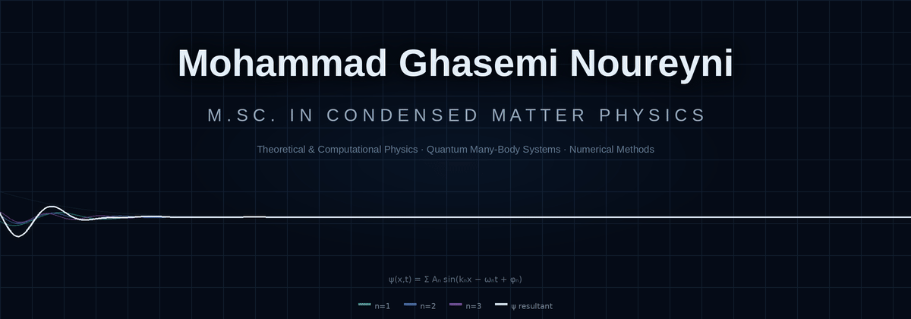

 

### M.Sc. in Condensed Matter Physics · Shahid Beheshti University

<strong>Theoretical &amp; Computational Physics</strong>
&nbsp;·&nbsp;
<strong>Quantum Many-Body Systems</strong>
&nbsp;·&nbsp;
<strong>Numerical Methods</strong>

---

> **Using numerical methods to investigate quantum many-body physics and phase transitions.**

 

<table>
<tr>
<td width="50%" valign="top">

### 🔬 Research Interests

* Strongly correlated quantum systems
* Quantum many-body physics
* Quantum phase transitions
* Condensed matter theory
* Computational physics
* Excitation spectra

</td>

<td width="50%" valign="top">

### 🧮 Methods & Tools

**Methods**

`Continuous Unitary Transformations (CUT)`
`Flow Equations`
`Numerical Differential Equation Solvers`
`Computational Analysis`

**Tools**

`Python` · `NumPy` · `SciPy`
`Matplotlib` · `C++` · `LaTeX`
`Linux` · `Git`

</td>
</tr>
</table>

---

## Current Research

<table>
<tr>
<td align="center" width="25%">

**Strongly Correlated Systems**

</td>

<td align="center" width="25%">

**Ionic Hubbard Model**

</td>

<td align="center" width="25%">

**Continuous Unitary Transformations**

</td>

<td align="center" width="25%">

**Phase Transitions & Excitations**

</td>
</tr>
</table>

My current research investigates **strongly correlated quantum systems** using computational approaches to explore their physical properties, with particular focus on **phase transitions and excitation spectra**.

My M.Sc. research focuses on the **Ionic Hubbard Model**, studied using **Continuous Unitary Transformations (CUTs)** and flow-equation methods.

---

### From Computation to Physics

<table>
<tr>
<td align="center">

**Quantum Model**

</td>
<td align="center">→</td>
<td align="center">

**Numerical Calculation**

</td>
<td align="center">→</td>
<td align="center">

**Physical Analysis**

</td>
<td align="center">→</td>
<td align="center">

**Physics & Interpretation**

</td>
</tr>
</table>

---

### Academic Interests

**Condensed Matter Physics**
**Quantum Many-Body Theory**
**Strong Correlations**
**Phase Transitions**
**Computational Physics**

---

### Connect

<!-- Add your real links when available -->

 

Condensed Matter Physics · Quantum Many-Body Systems · Computational Physics

